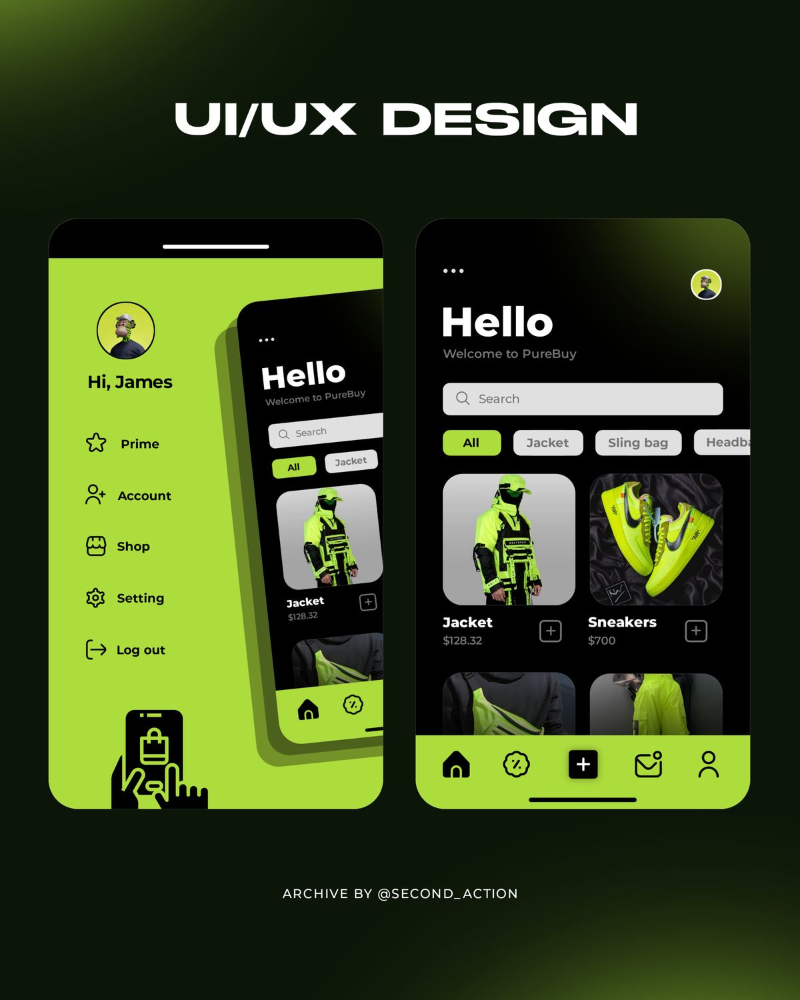
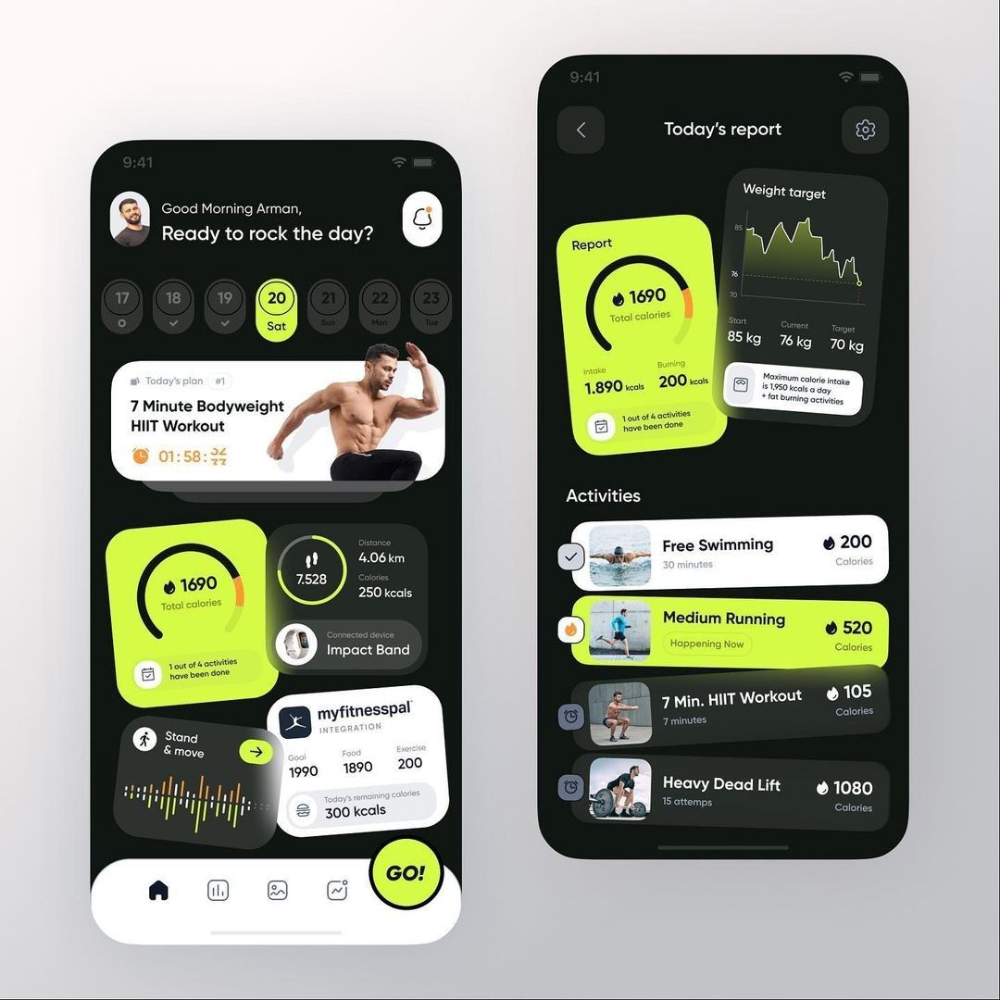
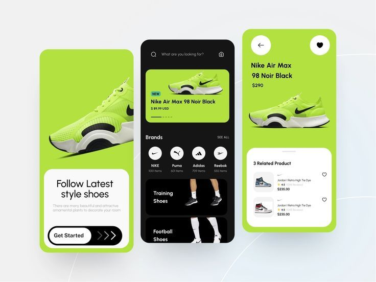

# Kinetic Volt — Smart Shoe Companion App

A React Native (Expo) companion experience for smart energy-harvesting footwear, built from the design system.

## 📱 UI / UX Preview

<p align="center">
  
  
  
</p>

<p align="center">
  
</p>


## Stack

- **Expo** SDK 51 (React Native 0.74)
- **TypeScript**
- **React Navigation** (bottom tabs)
- **react-native-svg** for the Kinetic battery/power ring
- **@react-native-async-storage/async-storage** for persistence (settings, LED config, theme, device name, daily history, firmware version)
- **expo-haptics** for control feedback (gated by the Haptic toggle)
- **@expo-google-fonts** — Plus Jakarta Sans + Space Grotesk, per the design spec

## Getting started

Requires Node.js 18+.

```bash
npm install
npm run start        # Expo dev server
npm run android      # Android emulator/device
npm run ios          # iOS simulator
npm run web          # web preview
```

## Scripts

```bash
npm run typecheck    # tsc --noEmit
npm run lint         # eslint (expo config)
npx expo export --platform android   # production JS bundle
npx expo-doctor      # project health (1 known warning: newArchEnabled schema false-positive on SDK 51)
```

## Features

- **Dashboard Cockpit** — Kinetic battery/power gauge with live piezo pulse state, voltage/current/output metric cards, daily step progress, live workout tracking (pace, cadence, harvest rate, timer, and finish summary), weekly step chart, and energy-harvest histogram with 1H / 24H / Week ranges.
- **Stride Analytics & Biomechanics** — Self-generated clean power impact (Wh, km, CO₂ offset), sole pressure foot-strike distribution (Forefoot, Midfoot peak harvest, Heel), gait dynamics (ground contact time, vertical oscillation, pronation tilt, harvest efficiency), filterable activity sessions (running/walking), and biometric dataset export.
- **Hardware & Device Control** — Simulated BLE 5.3 footwear link, Dual Sole independent monitoring (Left vs Right shoe battery, harvest, temp, and stride symmetry balance), motorized auto-lacing tension presets (Relaxed, Commute, Athletic, Sprint) with micro-adjustments, sole haptic guidance modes (Cadence, Heel Alert, Milestone), LED customization (color swatches, brightness slider, patterns), and interactive sole sensor calibration.
- **Settings & User Profile** — Dark/Light kinetic appearance, user biomechanical profile (daily step goal, calibrated stride length, shoe size, body weight profile), preferences toggles (haptics, notifications, telemetry, ambient lighting), OTA firmware updates with simulated flashing, battery & cell diagnostics (health %, cycle count, impedance), and local data/calibration management.
- **Theme system** — Full dark + light palettes from `DESIGN.md` via `ThemeProvider`/`useTheme`; every component is glassmorphic, theme-aware, and responsive.
- **Smart alerts** — Dynamic banners for connection loss, sensor circuit faults, and low battery with one-tap reconnect actions.

The `useDeviceState` hook simulates real-time kinetic energy harvest telemetry ($P = V \times I$ physics, piezoelectric transducer output, temperature, step count, and battery charging) so the companion UI is completely functional and alive without physical hardware.

## Project structure

```
App.tsx                     # root: fonts, safe area, providers, navigation theme
src/
  theme/                    # palettes, ThemeProvider, typography, spacing/radius/shadows
  components/               # KineticGauge, GlassCard, buttons, charts, scanner modal, etc.
  screens/                  # Dashboard, Analytics, Device, Settings
  navigation/               # floating pill dock bottom tab navigator
  store/                    # DeviceProvider, SettingsProvider (app-wide shared state)
  hooks/                    # useDeviceState, usePersistentSettings, useStepHistory
  utils/                    # deviceModel types, haptics, bleDiscovery
```